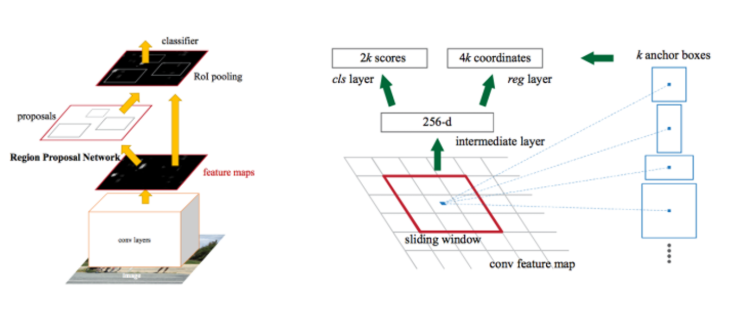

# R-CNN(Regions with Convolution Neural Network)

- 정의
  - 기존의 descriptor를 이용한 Image dection 방식에서, descriptor의 역할을 CNN이 대체하자는 것

- 과정

  1) Region proposal algorithm

  - 대상의 class를 구분하지 않고 이미지로부터 region을 추출해내는 과정
  - Selective search 방법
    - 비슷한 질감이나 색, 강도를 가진 인접한 픽셀들을 연결하여 바운딩 박스를 구성하는 방법
  - 바운딩 박스의 output을 다시 CNN 레이어의 인풋으로 활용하게 되고, input으로 변환하는 과정에서 압축(warp)을 하게 됨.

  2) CNN: feature vector extract

  - 앞 단계에서 생성한 region을 압축한 input으로, pre-trained 된 CNN 모듈에 통과시켜 새로운 피처를 생성
  - AlextNet, VggNet을 기반으로 튜닝 과정을 거친 CNN 모델을 사용

  3) Classify Algorithm

  - Fixed-length feature vector를 input으로 하는 분류기를 마지막으로 달아줌.
  - input을 바탕으로 객체인지 아닌지, 맞다면 어떤 객체인지를 분류

  4) Bounding Box 개선 문제

  - 결과물을 더 완벽하게 하기 위한 단계
    - 성능 높여주기 위함.
  - region proposal 단계에서 더욱 타이트한 bounding box를 만들자는 단계

- 장단점
  - 장점
    - 
  - 단점
    - 모든 Proposal에 대해 CNN을 거쳐야 하므로 연산량이 매우 많은 단점

- 참고링크

https://yamalab.tistory.com/110

([Image Object Detection] R-CNN)

# Fast R-CNN

- 정의

  - 모든 Proposal이 네트워크를 거쳐야 하는 R-CNN의 병목 구조의 단점을 개선하고자 제안 된 방식
  - 가장 큰 차이점은, 각 Proposal들이 CNN을 거치는 것이 아니라 전체 이미지에 대해 CNN을 한번 거친 후 출력 된 특징맵(Feature map)단에서 객체 탐지를 수행

- 과정

  1) 1 CNN on the entire image

  2) Extract features from feature map regions

  3) Classify region-based features

  4) Complexity: ~600 x 1000 x 1

  5) ~160x faster than R-CNN

# Faster R-CNN

- 정의

  - Region Proposal을 RPN이라는 네트워크를 이용하여 수행(병목현상 해소)
  - Region Proposal 단계에서의 bottleneck 현상 제거
    - 해당 단계를 기존의 Selective search가 아닌 CNN(RPN)으로 해결
  - CNN을 통과한 Feature map에서 슬라이딩 윈도우를 이용해 각 지점마다 가능한 바운딩 박스의 좌표와 그 점수를 계산

- 과정

  

# R-CNN vs Fast R-CNN vs Faster R-CNN

# Mask R-CNN

# Mask Scoring R-CNN

# SSD(Single Shot Multi-box Detector)

- 참고자료

https://seongkyun.github.io/papers/2019/01/06/Object_detection/

(R-CNN/Fast R-CNN/Faster R-CNN/SSD 가볍게 알아보기)